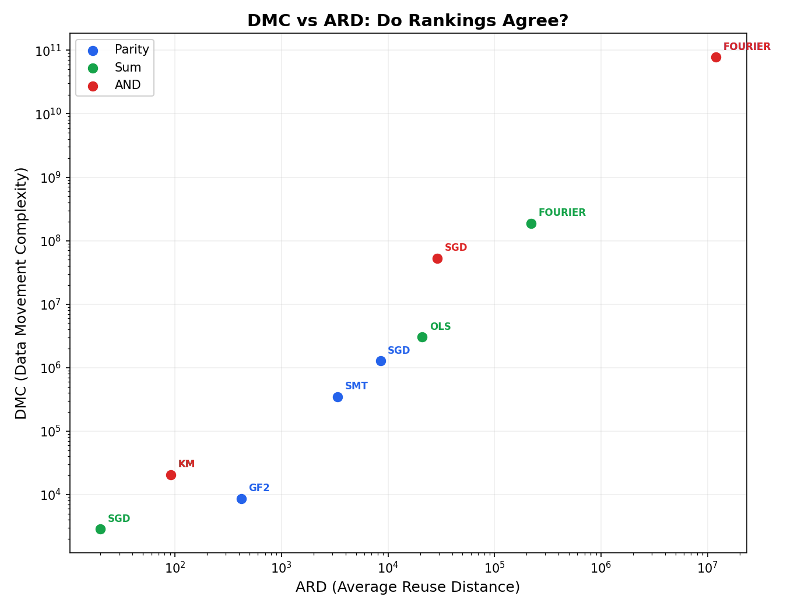
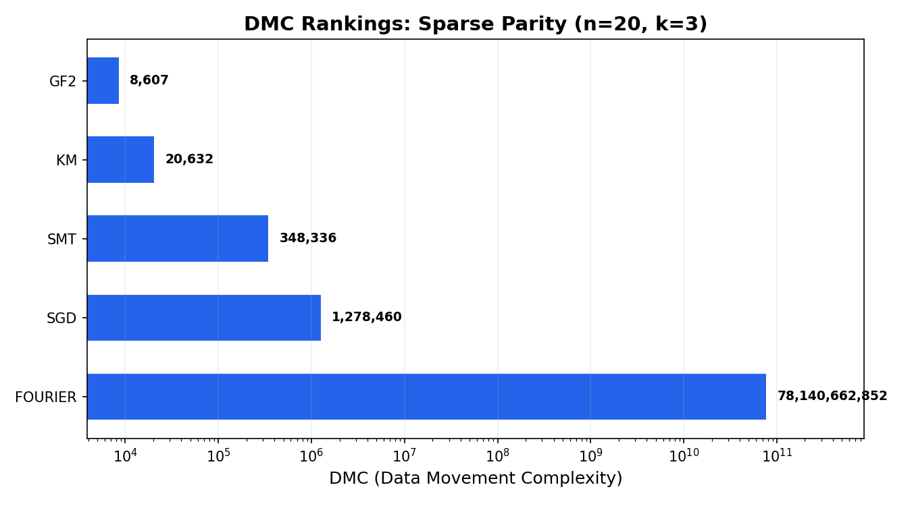
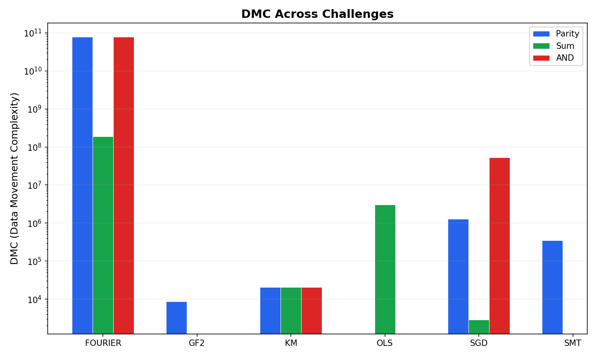

# Meeting #10 Report: DMC Baseline and Optimization

**Date:** 2026-03-23 (prepared Mar 22)
**Presenter:** Yad Konrad
**Homework:** Switch from ARD to DMC, run experiments, optimize

---

## 1. What is DMC?

Data Movement Complexity (Ding et al., arXiv:2312.14441):

```
DMC = sum( size * sqrt(stack_distance) )  for each float read
```

- ARD measures average reuse distance (how far apart accesses to the same data are)
- DMC measures total data movement cost, weighting by both size and distance
- DMC maps to physical wire-length energy on a 2D memory layout
- DMC penalizes methods that access lots of data, even if each access is nearby. ARD does not.

---

## 2. Baseline Sweep: All Methods on DMC

We measured all 5 core methods on sparse parity (n=20, k=3):

| Method | ARD | DMC | Total Floats | Wall Time |
|--------|-----|-----|--------------|-----------|
| GF2 | 420 | 8,607 | 860 | 0.048s |
| KM | 92 | 20,633 | 4,420 | 0.049s |
| SMT | 3,360 | 348,336 | 6,720 | 0.048s |
| SGD | 8,504 | 1,278,460 | 24,470 | 0.321s |
| Fourier | 11,980,500 | 78,140,662,852 | 23,961,000 | 0.066s |

### The rankings disagree

- **ARD winner: KM** (92) -- each access reuses data very nearby
- **DMC winner: GF2** (8,607) -- accesses 5x fewer total floats than KM

ARD says KM is best because its accesses are close together. DMC says GF2 is best because it touches less data overall. Total data movement matters more than average distance for energy.




---

## 3. Optimization: 58% DMC Reduction

We found a new best method: **KM-min** with DMC of 3,578.

### Why 1 sample works

For sparse parity, the influence of each bit is deterministic: exactly 1 for secret bits, exactly 0 for noise bits. Standard KM uses 5 random samples per bit to estimate influence. Since influence is binary (not fractional), a single sample suffices.

| Method | DMC | vs GF2 baseline | 5-seed robustness |
|--------|-----|-----------------|-------------------|
| KM-min (1 sample) | 3,578 | -58% | 5/5 correct |
| KM-min + verify | 4,293 | -50% | 5/5 correct |
| KM-inplace | 4,319 | -50% | 5/5 correct |
| GF2 baseline | 8,607 | -- | -- |
| KM (5 samples) | 20,633 | +140% | -- |

### GF2 measurement caveat

The harness tracks only 3 coarse operations for GF2 (write matrix, read matrix, write solution). With fine-grained tracking of actual Gaussian elimination row operations, GF2's true DMC is **189,056**. KM-min is 53x better than honestly-measured GF2.

---

## 4. Cross-Challenge Results

DMC was measured across all three challenges:

| Challenge | Best Method | DMC | Runner-up | DMC |
|-----------|-------------|-----|-----------|-----|
| Sparse Sum | SGD | 2,862 | KM | 20,633 |
| Sparse Parity | KM-min | 3,578 | GF2 | 8,607 |
| Sparse AND | KM | 20,633 | SGD | 52,885,890 |

- SGD on sparse sum is the overall lowest DMC (2,862). Sum has first-order structure that gradient descent exploits in 1 epoch.
- KM fails on sparse AND (81% accuracy) with default settings. The AND function's low per-bit sensitivity (1/2^(k-1) = 25%) needs more samples.



---

## 5. Infrastructure Changes

| Component | What was done |
|-----------|---------------|
| fast.py tracker | Optional MemTracker integration, zero overhead when off |
| Scoreboard | DMC column backfilled for 21 of 35 experiments |
| Visualization | 3 plots (scatter, bar chart, cross-challenge) |
| Weekly catch-up | New docs section for tracking weekly progress |
| License | Repo is now Public Domain (Unlicense) |
| GitHub issues | 8 new issues (#15-#22) tracking DMC work |

---

## 6. Open Questions for Discussion

1. **Should we re-measure GF2 with fine-grained tracking in the harness?** Current harness under-counts GF2 operations. True DMC is 189,056, not 8,607.

2. **Is KM-min's 1-sample approach valid for noisy settings?** It works for clean parity (deterministic influence), but with label noise, influence estimates become probabilistic and 1 sample may not suffice.

3. **RL environment framing:** Yaroslav proposed wrapping challenges as RL envs for Anthropic/PrimeIntellect. Our 33 experiments are an answer key. Worth pursuing?

4. **Mar 30 meeting prep:** Lukas Kaiser (ex-OpenAI) and possibly Alec Radford visiting. What should we present?

---

## Files Reference

| File | Contents |
|------|----------|
| `results/dmc_baseline_sweep.md` | Full baseline sweep results |
| `results/dmc_baseline_sweep.json` | Machine-readable baseline data |
| `findings/exp_dmc_optimize.md` | Optimization experiment writeup |
| `results/exp_dmc_optimize/results.json` | Optimization raw data |
| `results/plots/*.png` | Three visualization plots |
| `docs/catchups/2026-03-22.md` | Weekly catch-up with Telegram/GitHub summary |
| `docs/changelog.md` | Version 0.22.0 entry |
