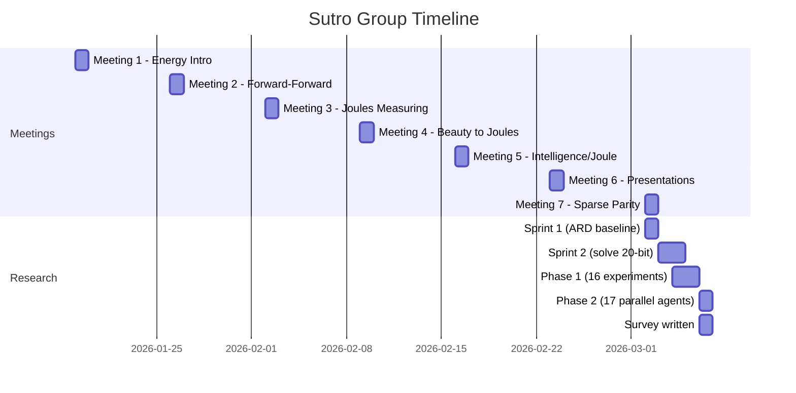

# Context

## What is this?

A research environment for the Sutro Group's work on energy-efficient AI training. The group's thesis: go back to 1960s-era AI problems and reinvent learning algorithms using modern tools (AI agents, compute), with energy efficiency as the optimization target.

## Why Sparse Parity?

Sparse parity is the "drosophila" of learning tasks:

- **Simplest non-trivial** learning problem (XOR was the example Minsky used to trigger the AI winter)
- **Easy to scale** difficulty (add noise bits)
- **Fast to iterate** (0.12s with numpy, <2s even in pure Python)
- **Exposes** memory access patterns in backprop
- **Well-studied** in theory (Barak et al. 2022, Kou et al. 2024)

## What We Found

33 experiments across two phases. Full ranked results in the [Practitioner's Field Guide](research/survey.md).

### Phase 1: SGD optimization (16 experiments)

The 20-bit problem was "unsolvable" at LR=0.5. At LR=0.1 it solves in 5 epochs. From there we optimized ARD within the SGD framework, hitting a ceiling at ~10% because W1 accounts for 75% of all float reads. Forward-Forward has 25x worse ARD than backprop for 2-layer networks. Curriculum learning broke the scaling wall (n=50). The cache simulator showed L2 eliminates all misses.

### Phase 2: Broad search (17 experiments)

Parity is linear over GF(2). GF(2) Gaussian elimination solves in 509 microseconds, 240x faster than SGD. Kushilevitz-Mansour influence estimation achieves ARD 1,585 (724x better than Fourier). All four local learning rules (Hebbian, Predictive Coding, Equilibrium Propagation, Target Propagation) fail at chance level because parity requires k-th order interaction detection.

### Key insight

For small k, sparse parity is a search problem, not a learning problem. The neural network was solving an easy problem the hard way.

## Timeline

## People

| Name | Role / Focus |
|------|-------------|
| **Yad** | Created this repo (SutroYaro), built the Claude Code autonomous research lab: parallel agent teams, experiment templates, DISCOVERIES.md knowledge accumulation |
| **Yaroslav** | Sutro Group founder, technical sprints, algorithm work, [cybertronai/sutro](https://github.com/cybertronai/sutro) |
| **Emmett** | Aster agentic loop framework, 2x energy improvement on microgpt |
| **G B** | Architecture experiments (depth-1/hidden-64, ARD ~33-35) |
| **Germaine** | Presentations, implementations |
| **Andy** | Chat tooling experiments |
| **Seth** | Healthcare AI, satisficing concepts |
| **Barak** | Modal workflow |
| **Jamie Simon** | Forward-Forward implementation |
| **Jonathan Belay** | Deterministic methods, spectral graph theory |
| **Anish Tondwalkar** | Former Google Brain/OpenAI, hardware perspective |
| **Caleb Sirak** | DIY AI supercomputer ("Howard") |
