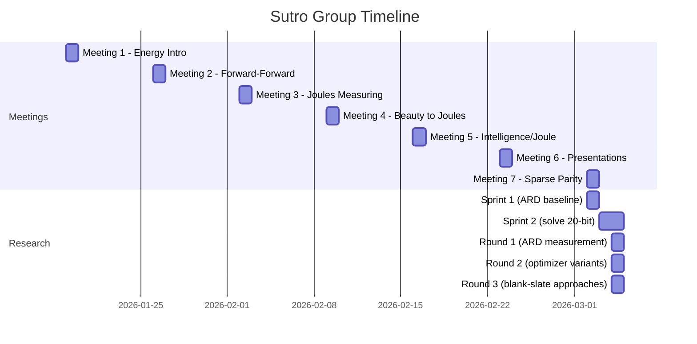

# Context

## What is this?

A research environment for the Sutro Group's work on energy-efficient AI training. The group's thesis: go back to 1960s-era AI problems and reinvent learning algorithms using modern tools (AI agents, compute), with energy efficiency as the optimization target.

## Why Sparse Parity?

Sparse parity is the "drosophila" of learning tasks:

- **Simplest non-trivial** learning problem (XOR was the example Minsky used to trigger the AI winter)
- **Easy to scale** difficulty (add noise bits)
- **Fast to iterate** (0.12s with numpy, <2s even in pure Python)
- **Exposes** memory access patterns in backprop
- **Well-studied** in theory (Barak et al. 2022, Kou et al. 2024)

## What We Found

### The 20-bit problem is solved

100% accuracy in 0.12 seconds. The fix was hyperparameters (LR=0.1, batch=32), not a new algorithm. See [Exp 1 findings](findings/exp1_fix_hyperparams.md).

### The ARD bottleneck is real but capped

!!! warning "The ARD Bottleneck"
    W1 (the first layer weight matrix) accounts for ~75% of all float reads. Its reuse distance is fixed regardless of update order. This caps operation-reordering improvements at ~10%.

Per-layer forward-backward gives 3.8% ARD improvement. Fused updates give 1.3%. Going further requires either smaller models or different algorithms.

### Forward-Forward is not the answer (for small networks)

Hinton's Forward-Forward has 25x WORSE ARD than backprop for 2-layer networks. The "local learning" advantage only kicks in for 10+ layer networks. See [Exp E findings](findings/exp_e_forward_forward.md).

### For small k, it's a search problem

The biggest insight: sparse parity with small k (k ≤ 7) is better solved by combinatorial search (Fourier / random search) than by training a neural network. Fourier solver: 0.009s, 13x faster than SGD. See [Exp Fourier findings](findings/exp_fourier.md).

### Scaling frontier

Standard SGD breaks at n^k > 100,000 iterations. Curriculum learning (train small n, expand network) pushes the frontier to n=50. Sign SGD solves k=5. For large k (≥ 10), SGD's implicit gradient search is the only feasible approach.

## Timeline

## People

| Name | Role / Focus |
|------|-------------|
| **Yad** | Created this repo (SutroYaro), built the Claude Code autonomous research lab: parallel agent teams, experiment templates, DISCOVERIES.md knowledge accumulation |
| **Yaroslav** | Sutro Group founder, technical sprints, algorithm work, [cybertronai/sutro](https://github.com/cybertronai/sutro) |
| **Emmett** | Aster agentic loop framework, 2x energy improvement on microgpt |
| **Germaine** | Presentations, implementations |
| **Andy** | Chat tooling experiments |
| **Seth** | Healthcare AI, satisficing concepts |
| **Barak** | Modal workflow |
| **Jamie Simon** | Forward-Forward implementation |
| **Jonathan Belay** | Deterministic methods, spectral graph theory |
| **Anish Tondwalkar** | Former Google Brain/OpenAI, hardware perspective |
| **Caleb Sirak** | DIY AI supercomputer ("Howard") |
