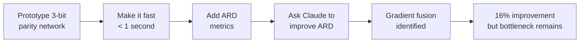

# Sprint 1 Findings

!!! note "Historical, Sprint 1 of 3"
    This was the first sprint. All candidate algorithms recommended here (Forward-Forward, per-layer updates, local learning) have since been implemented and tested. See [Exp E](exp_e_forward_forward.md) (FF: 25x worse ARD), [Exp C](exp_c_perlayer_20bit.md) (per-layer: 3.8% improvement), and the [changelog](../changelog.md) for the full story.

**Date**: 02 Mar 2026 | **Duration**: 2.5 hours

## Summary

Claude identified a gradient fusion strategy that improves energy efficiency slightly. Cache reuse improved by **16%**. A larger improvement requires a **different learning algorithm**.

## Setup

- 3-bit parity task, tiny neural network
- Pure Python implementation (no PyTorch overhead)
- <1 second total runtime constraint
- Tools: Claude Code, Gemini, Colab

## Process

## Finding: ARD Bottleneck in Backprop

!!! danger "The Bottleneck"
    Parameter tensors are read twice with the entire forward+backward pass in between. Gradient fusion only addresses 5% of total memory reads.

| Buffer | Floats Read | % of Total | Reuse Distance | Changed? |
|--------|------------|------------|----------------|----------|
| W1 | 6,000 | 32% | ~15,000 | No |
| b1 | 2,000 | 11% | - | No |
| dW2 | 1,001 | 5% | 16,005 -> 3,002 | Yes |
| db2 | 1,001 | 5% | 18,005 -> 5,002 | Yes |

The improved buffers (dW2, db2) contribute only **1,001 floats out of 19,013 total** -- just 5% of the weighted sum.

## Conclusion

Gradient fusion fixed the easy wins (gradient buffers), but the bottleneck is W1 and b1 being read in forward and again at the end of backward. To fix that, you need:

1. **Per-layer forward-backward** -- compute Layer 1's backward and update before Layer 2's forward (changes the math)
2. **Forward-Forward algorithm** -- no backward pass at all

## Artifacts

- Code: [cybertronai/sutro](https://github.com/cybertronai/sutro)
- Benchmark: [sparse_parity_benchmark.py](https://github.com/cybertronai/sutro/blob/e132532f67f97f927d4700afb913e76d5cbdab02/sparse_parity_benchmark.py)
- Colab: [fast version](https://colab.research.google.com/drive/1auWQjRgtrqyzef98wqq796sl927tCGMq)
- Gemini sessions: [runtime estimation](https://gemini.google.com/share/45a7920017e2), [ARD brainstorming](https://gemini.google.com/share/c99ec90874da), [ARD discussion](https://gemini.google.com/share/90bda930129a)
