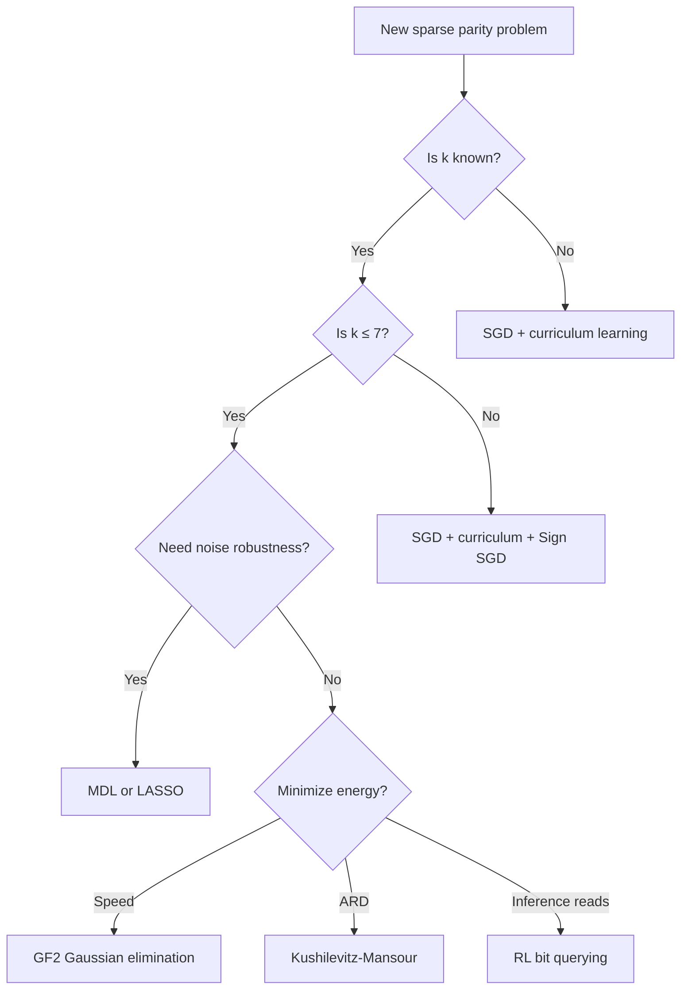

# Survey Implementation Plan

> **For Claude:** REQUIRED SUB-SKILL: Use superpowers:executing-plans to implement this plan task-by-task.

**Goal:** Write a practitioner's field guide surveying all 33 sparse parity experiments, with rankings, decision framework, and full AI research methodology.

**Architecture:** Single markdown document written section by section into `docs/research/survey.md`, then copied to repo root. Nav and index updates follow. Anti-slop guide applied to all prose.

**Tech Stack:** Markdown, Mermaid diagrams, MkDocs Material theme

---

### Task 1: Update mkdocs.yml nav with 17 new findings pages

**Files:**
- Modify: `mkdocs.yml:81-98`

**Step 1: Add new findings entries to the nav**

Add these 17 entries under the existing `Findings:` section in the nav, after the existing entries and before `Prompting Strategies`:

```yaml
          # ... existing entries ...
          - Fourier Solver (Blank Slate): findings/exp_fourier.md
          - Evolutionary Search (Blank Slate): findings/exp_evolutionary.md
          - Feature Selection (Blank Slate): findings/exp_feature_select.md
          # NEW: Phase 2 experiments
          - Mutual Information: findings/exp_mutual_info.md
          - LASSO: findings/exp_lasso.md
          - Decision Trees: findings/exp_decision_tree.md
          - GF(2) Gaussian Elimination: findings/exp_gf2.md
          - Random Projections: findings/exp_random_proj.md
          - Kushilevitz-Mansour: findings/exp_km.md
          - Hebbian Learning: findings/exp_hebbian.md
          - Predictive Coding: findings/exp_predictive_coding.md
          - Equilibrium Propagation: findings/exp_equilibrium_prop.md
          - Target Propagation: findings/exp_target_prop.md
          - Tiled W1: findings/exp_tiled_w1.md
          - Pebble Game Optimizer: findings/exp_pebble_game.md
          - Binary Weights: findings/exp_binary_weights.md
          - Genetic Programming: findings/exp_genetic_prog.md
          - SMT Solver: findings/exp_smt.md
          - RL Bit Querying: findings/exp_rl.md
          - MDL Compression: findings/exp_mdl.md
          - Prompting Strategies: findings/prompting-strategies.md
```

Also add the survey page under Research, before Findings:

```yaml
      - Survey: research/survey.md
```

**Step 2: Verify mkdocs builds**

Run: `cd /Users/yadkonrad/dev_dev/year26/feb26/SutroYaro && mkdocs build --strict 2>&1 | tail -5`
Expected: no errors about missing files

**Step 3: Commit**

```bash
git add mkdocs.yml
git commit -m "nav: add 17 new findings pages and survey to mkdocs"
```

---

### Task 2: Write Section 1 — TL;DR

**Files:**
- Create: `docs/research/survey.md`

**Step 1: Write the TL;DR section**

Start the file with the document header and TL;DR. The ranked table must include all 33 experiments. Pull actual numbers from:
- `DISCOVERIES.md` (Phase 1 experiments)
- `results/exp_*/results.json` (Phase 2 experiments)
- The agent completion summaries in this conversation

The table columns: Rank, Method, Phase, Accuracy (n=20/k=3), Time, ARD, Verdict (one phrase).

Rank by speed (wall time to solve n=20/k=3). Below the table, three bullets:
- Fastest: GF(2) at ~500μs
- Best energy proxy: KM at ARD 1,585 (or RL at ARD 1 for inference)
- Most general (scales to high k): GF(2) (k-independent) or SGD+curriculum (works without knowing k)

**Anti-slop check:** No "comprehensive," no "noteworthy," no em dashes. Just the table and three bullets.

**Step 2: Verify the file renders**

Run: `cd /Users/yadkonrad/dev_dev/year26/feb26/SutroYaro && mkdocs build --strict 2>&1 | grep survey`

**Step 3: Commit**

```bash
git add docs/research/survey.md
git commit -m "survey: add TL;DR with ranked results table"
```

---

### Task 3: Write Section 2 — The Problem

**Files:**
- Modify: `docs/research/survey.md`

**Step 1: Write problem definition**

Append Section 2. Cover:
- Sparse parity: n-bit input, k secret bits, label = product of secret bit values
- Why it matters: simplest non-trivial learning task, solvable on 1960s hardware, fast iteration (<2s)
- ARD definition: average number of intervening float accesses between writing and reading the same buffer
- Cache model: L1 (64KB), L2 (256KB), HBM. Energy per access: register 5pJ, L1 20pJ, L2 100pJ, HBM 640pJ
- Constraints: train+eval under 2 seconds, test accuracy above 90%
- Configs tested: n=20/k=3 (standard), n=50/k=3 (scaling), n=20/k=5 (higher order)

**Anti-slop check:** No "in today's," no "it's worth noting." Define terms once, use them. One paragraph per concept.

**Step 2: Commit**

```bash
git add docs/research/survey.md
git commit -m "survey: add problem definition section"
```

---

### Task 4: Write Section 3 — Phase 1: Incremental Improvements

**Files:**
- Modify: `docs/research/survey.md`

**Step 1: Write Phase 1 narrative**

Append Section 3. This tells the story of the 16 original experiments. Structure as a numbered sequence of moves, each with the result and what it told us:

1. Yaroslav's Sprint 1: built pure-Python net, added ARD tracking, Claude found gradient fusion (16% cache reuse improvement). But W1 dominates.
2. Fix hyperparams (exp1): LR=0.1 not 0.5, n_train=500, batch=32. Solved 20-bit at 99% in epoch 52.
3. GrokFast (exp4): counterproductive. 83x more weight movement, slower convergence.
4. Single-sample SGD: 5 epochs to 100% with correct hyperparams. Faster than batch.
5. Per-layer forward-backward (exp_a, exp_c): 3.8% ARD improvement, identical accuracy.
6. Batch ARD (exp_b): raw ARD 17x higher but misleading. Need cache model.
7. Cache simulator (exp_cache_ard): L2 eliminates all misses. Single-sample is more L1-friendly. Batch wins on traffic.
8. Forward-Forward (exp_e): 25x worse ARD, can't solve 20-bit.
9. Weight decay sweep (exp_wd_sweep): WD=0.01 optimal.
10. Scaling frontier (exp_d): SGD breaks at n^k > 100K.
11. Sign SGD (exp_sign_sgd): 2x faster on k=5.
12. Curriculum (exp_curriculum): 14.6x speedup, transfer is instant.
13. Per-layer + batch (exp_perlayer_batch): works but 3.7x wall-time overhead.
14-16. Blank slate: Fourier (13x faster), evolutionary (solves n=50/k=3), feature selection (pairwise provably fails, exhaustive 178x ops speedup).

The wall: after exp_a showed W1 dominates 75% of reads, the ceiling for operation reordering was ~10%. This motivated the pivot.

Link each experiment name to its findings page: `[exp1](../findings/exp1_fix_hyperparams.md)`.

**Anti-slop check:** No "aha moment," no "game-changer." State what was tried, what happened, what it meant. Numbers only.

**Step 2: Commit**

```bash
git add docs/research/survey.md
git commit -m "survey: add Phase 1 narrative"
```

---

### Task 5: Write Section 4 — Phase 2: Broad Search

**Files:**
- Modify: `docs/research/survey.md`

**Step 1: Write Phase 2 by taxonomy**

Append Section 4. Five subsections by category. For each category: one paragraph of context, then a table of results, then one paragraph of analysis.

**Algebraic / Exact:**

| Method | Accuracy | Time (n=20/k=3) | ARD | Scales to high k? |
|--------|----------|-----------------|-----|-------------------|
| GF(2) | 100% | ~500μs | minimal | Yes (k-independent) |
| KM | 100% | 0.006s | 1,585 | Yes (poly in 2^k) |
| SMT/backtracking | 100% | 0.002s | minimal | Depends on solver |

Analysis: parity is linear over GF(2). Linear algebra solves it. KM's influence estimation prunes the search to O(n). These are the correct tools.

**Information-Theoretic:**

| Method | Accuracy | Time | ARD | Advantage over Fourier? |
|--------|----------|------|-----|------------------------|
| MI | 100% | 0.033s | 1,147,375 | None (3.7x slower) |
| LASSO | 100% | 0.005s | same | Competitive speed, robust |
| MDL | 100% | 0.27s | same | Noise-robust |
| Random Proj | 100% | varies | same | Saves 30-70% evaluations, high variance |

Analysis: all solve it but none beat Fourier meaningfully for binary parity. LASSO is competitive. MDL's generality matters if you don't know the labeling function.

**Local Learning Rules:**

| Method | Best accuracy | Why it failed |
|--------|--------------|---------------|
| Hebbian | ~50% | Only detects 1st/2nd order statistics |
| Predictive Coding | ~51-55% | Generative direction harder; 18x worse ARD |
| Equilibrium Prop | ~60% | 2,300x slower; tanh saturation |
| Target Prop | ~55% | Target collapse: input-independent targets |

Analysis: parity is a k-th order interaction. Any method limited to local statistics cannot detect it. This is structural, not a tuning issue.

**Hardware-Aware:**

| Method | Result | Key finding |
|--------|--------|-------------|
| Tiled W1 | ARD worse (+6.8%) | Software metric can't capture hardware cache benefit |
| Pebble Game | 2.2% energy savings | Fused/per-layer orderings silently break training |
| Binary Weights | Fails n=20 | STE too crude for feature selection |

**Alternative Framings:**

| Method | Result | Key finding |
|--------|--------|-------------|
| GP | Solves n=20/k=3 only | Zero-param symbolic solution, but needle-in-haystack for larger n |
| RL | Solves all | k reads per prediction (theoretical minimum inference ARD) |
| Decision Trees | 92.5% best | Greedy splits fail for parity |

Link each experiment to its findings page.

**Anti-slop check:** No "mixed results," no "interestingly." Tables carry the data. Analysis paragraphs explain the structural reason.

**Step 2: Commit**

```bash
git add docs/research/survey.md
git commit -m "survey: add Phase 2 broad search results"
```

---

### Task 6: Write Section 5 — Results Leaderboard

**Files:**
- Modify: `docs/research/survey.md`

**Step 1: Write three ranked tables**

Append Section 5. Three tables, each sorted by one metric. Include all 33 experiments (or all that apply). Top 10 per table is fine if 33 rows is too long.

Table 1: **By speed** (wall time, n=20/k=3). Columns: Rank, Method, Time, Note.
Table 2: **By energy proxy** (weighted ARD, single training step). Columns: Rank, Method, ARD, Note.
Table 3: **By generality** (largest config solved). Columns: Rank, Method, Max config, Note.

Pull numbers from results JSONs and findings docs. Be precise.

**Step 2: Commit**

```bash
git add docs/research/survey.md
git commit -m "survey: add results leaderboard"
```

---

### Task 7: Write Section 6 — Decision Framework

**Files:**
- Modify: `docs/research/survey.md`

**Step 1: Write parity-specific flowchart**

Append Section 6a. Use a mermaid flowchart:



**Step 2: Write generalized principles**

Append Section 6b. Numbered list of transferable lessons. Each principle is one sentence followed by the experiment(s) that proved it. Target 8-12 principles. Examples:

1. Check for algebraic structure before reaching for gradient descent. (GF(2) solves in microseconds what SGD takes seconds for.)
2. Raw ARD is misleading without a cache model. (exp_cache_ard: L2 eliminates all misses.)
3. Local learning rules fail when the signal lives in high-order interactions. (Hebbian, PC, EP, TP all at chance.)
4. One tensor can dominate your energy budget. Measure before optimizing. (exp_a: W1 = 75% of reads.)
5. Curriculum learning transfers when the hard part is feature selection, not function complexity. (exp_curriculum: >95% in epoch 1 after expansion.)
6. Software metrics and hardware behavior diverge. (Tiled W1 worsened software ARD but would improve L1 cache performance.)
7. Greedy methods fail for parity. Any method that tests one variable at a time gets zero signal. (Decision trees, greedy feature selection, Hebbian.)
8. The problem you think is hard may just be misconfigured. (20-bit "hard problem" was LR=0.5 instead of 0.1.)

**Step 3: Commit**

```bash
git add docs/research/survey.md
git commit -m "survey: add decision framework"
```

---

### Task 8: Write Section 7 — The AI Research Process

**Files:**
- Modify: `docs/research/survey.md`

**Step 1: Write 7a — the agentic loop**

Append Section 7a. Describe the experiment infrastructure:
- Template file (`_template.py`): baseline vs experiment, comparison, JSON output
- Shared modules: `config.py`, `data.py`, `model.py`, `tracker.py`, `metrics.py`, `cache_tracker.py`
- Knowledge accumulation: `DISCOVERIES.md` as the "read before starting" file
- Output pipeline: experiment.py → results.json → findings.md → docs/findings/ → mkdocs nav

Include the template structure (abbreviated). Reference `findings/prompting-strategies.md` for detailed prompting notes.

**Step 2: Write 7b — parallel dispatch**

Append Section 7b. Describe the Phase 2 parallel agent run:
- 17 independent agents dispatched simultaneously
- Each agent received: approach description, template pattern, shared module APIs, configs to run, findings format
- Completion times: fastest ~2.5 minutes (MI, MDL), slowest ~38 minutes (Pebble Game)
- Failure modes encountered:
  - Data generation bugs (different seeds for train/test producing different secrets)
  - Even-k parity inversion (GF(2) agent discovered and fixed)
  - Target collapse (Target Prop agent diagnosed structural failure)
  - Tanh saturation (Equilibrium Prop)
  - Value-aware state explosion (RL agent pivoted to value-blind)
- All agents produced: working Python file, results JSON, findings markdown in both locations

**Step 3: Write 7c — what worked and what didn't**

Append Section 7c. Cover:
- Literature-first prompting: giving agents the theoretical context (e.g., "parity is linear over GF(2)") led to correct implementations. Without it, agents would try generic approaches.
- The diagnose-then-fix pattern: agents that hit failures and explained WHY produced better findings than ones that just reported numbers.
- DISCOVERIES.md prevented repeated mistakes: no agent tried LR=0.5 or GrokFast because the file said those were known-bad.
- Anti-slop guide for findings: consistent format, no filler, actual numbers.
- Specific prompt patterns that worked: "It's OK if this fails. Document WHY it fails." produced better negative results. "Run and verify before writing findings" prevented hallucinated numbers.
- What didn't work: Pyright diagnostics from missing PYTHONPATH (harmless but noisy). Some agents had unused variable warnings. Two agents had bugs that required code fixes during execution.

**Step 4: Commit**

```bash
git add docs/research/survey.md
git commit -m "survey: add AI research process methodology"
```

---

### Task 9: Write Section 8 — Appendix + finalize

**Files:**
- Modify: `docs/research/survey.md`

**Step 1: Write appendix**

Append Section 8. Two parts:
- Links to all 33 findings pages (grouped by phase)
- Links to code: `src/sparse_parity/experiments/` directory, `results/` directory

**Step 2: Add document header**

Go back to the top and add:
```markdown
# Sparse Parity: A Practitioner's Field Guide

33 experiments across 17 methods for energy-efficient learning on the simplest non-trivial task.

**Sutro Group, Challenge #1** | March 2026 | [Source code](https://github.com/cybertronai/SutroYaro)
```

**Step 3: Full anti-slop review**

Read the complete document and check against the anti-slop guide:
- No em dashes (replace with commas or periods)
- No Tier 1 words (delve, landscape, tapestry, showcase, etc.)
- No throat-clearing openers
- No rule of three (use two items)
- No binary contrasts ("Not X. Y.")
- No "serves as" / "stands as" (use "is")
- Sentence length varies
- No paragraph ends with a punchy one-liner repeatedly

**Step 4: Commit**

```bash
git add docs/research/survey.md
git commit -m "survey: add appendix and finalize"
```

---

### Task 10: Copy to repo root + update DISCOVERIES.md + update research index

**Files:**
- Create: `survey.md` (repo root, copy of `docs/research/survey.md`)
- Modify: `DISCOVERIES.md`
- Modify: `docs/research/index.md`

**Step 1: Copy survey to repo root**

```bash
cp docs/research/survey.md survey.md
```

**Step 2: Update DISCOVERIES.md**

Add the 17 new experiments to the Proven Facts sections and Experiment Log table. Group by category. Add new sections for:
- Algebraic/Exact methods
- Information-Theoretic methods
- Local Learning Rules (and why they fail)
- Hardware-Aware approaches
- Alternative Framings

Update Open Questions: mark answered ones, add new ones from the 17 experiments.

**Step 3: Update research index**

In `docs/research/index.md`, add a link to the survey at the top. Update the checklist to mark the 17 proposed approaches as completed. Add the new findings to the topics list.

**Step 4: Commit**

```bash
git add survey.md DISCOVERIES.md docs/research/index.md
git commit -m "survey: standalone copy, update DISCOVERIES.md and research index"
```

---

### Task 11: Final verification

**Step 1: Build mkdocs and check for errors**

Run: `cd /Users/yadkonrad/dev_dev/year26/feb26/SutroYaro && mkdocs build --strict 2>&1 | tail -20`
Expected: clean build, no warnings about missing pages

**Step 2: Verify all 33 findings pages render**

Run: `ls docs/findings/exp_*.md | wc -l`
Expected: 30 (16 original + 14 new with exp_ prefix)

Run: `ls docs/findings/*.md | wc -l`
Expected: 33 (30 + sprint-1-findings.md + exp1_fix_hyperparams.md + prompting-strategies.md)

**Step 3: Spot-check survey links**

Open `docs/research/survey.md` and verify at least 5 internal links resolve to real files.

**Step 4: Commit any fixes**

```bash
git add -A
git commit -m "survey: fix any broken links or build issues"
```
