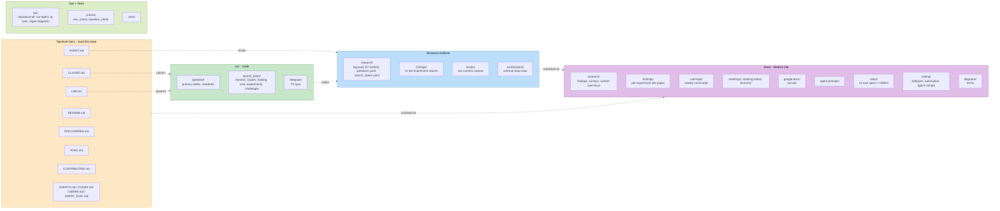

# Repo Layout

The SutroYaro workspace splits into four layers: read-first docs that load agent context, source code (with the locked harness and the ByteDMD metric), machine-readable research artifacts, and the published mkdocs site. The diagram below groups directories by role rather than enumerating every leaf.

<button data-mpz="in" title="Zoom in" style="width: 32px; height: 32px; border: 1px solid var(--md-default-fg-color--lightest); border-radius: 4px; background: var(--md-default-bg-color); color: var(--md-default-fg-color); cursor: pointer; font-size: 16px; line-height: 1;">＋</button>
<button data-mpz="out" title="Zoom out" style="width: 32px; height: 32px; border: 1px solid var(--md-default-fg-color--lightest); border-radius: 4px; background: var(--md-default-bg-color); color: var(--md-default-fg-color); cursor: pointer; font-size: 16px; line-height: 1;">−</button>
<button data-mpz="reset" title="Reset zoom" style="width: 32px; height: 32px; border: 1px solid var(--md-default-fg-color--lightest); border-radius: 4px; background: var(--md-default-bg-color); color: var(--md-default-fg-color); cursor: pointer; font-size: 14px; line-height: 1;">⤾</button>

<!-- BEGIN_AUTOGEN mermaidLayout (regenerate via bin/regen-diagrams) -->

<!-- END_AUTOGEN mermaidLayout -->

## What each layer does

- **Read-first docs** load agent context. A coding agent opens CLAUDE.md, then LAB.md or AGENT.md, then DISCOVERIES.md before touching code.
- **`src/`** holds the locked harness, the ByteDMD tracer, training code, the Gymnasium eval environment, and per-experiment scripts.
- **Ops + tests** contain reproducibility checks and the CLI scripts that orchestrate experiments and syncs.
- **Research artifacts** are machine-readable. `research/log.jsonl` is the append-only experiment log, `findings/` holds the prose writeups, `results/` holds the numbers.
- **`docs/`** is the mkdocs source for [cybertronai.github.io/SutroYaro](https://cybertronai.github.io/SutroYaro/). It mirrors much of the research output in a navigable form and adds meeting notes, weekly catchups, and reusable agent prompts.

!!! info "Active research front"
    Day-to-day method work happens in the ByteDMD repo, not here. The current experimental front is [`cybertronai/ByteDMD/experiments/grid`](https://github.com/cybertronai/ByteDMD/tree/dev/experiments/grid) (Yaroslav's self-contained experiments). This workspace is the lab notebook, contributor pipeline, and public site around that work.
